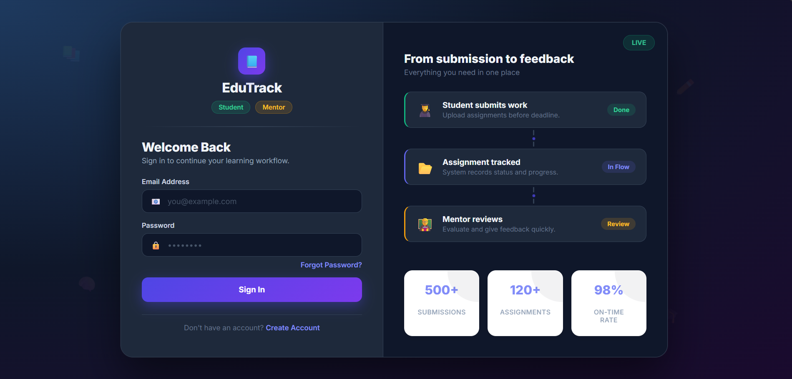
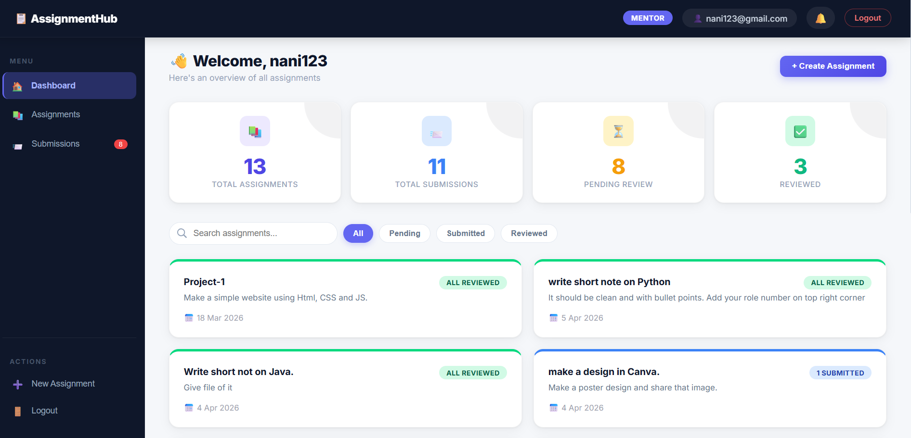
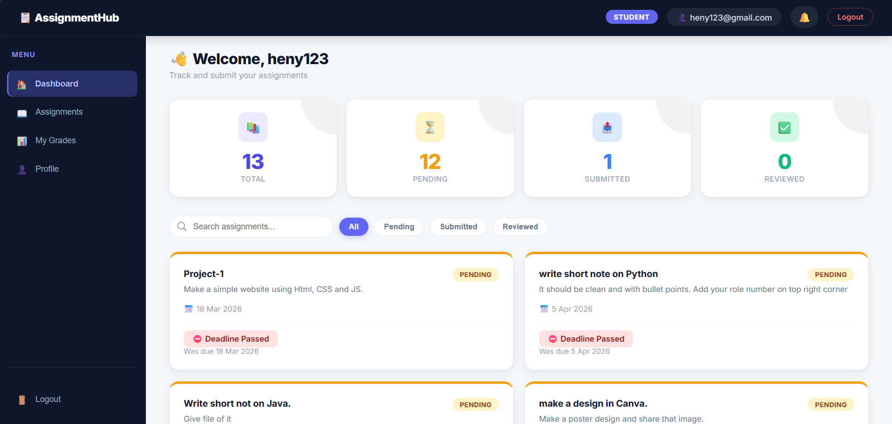
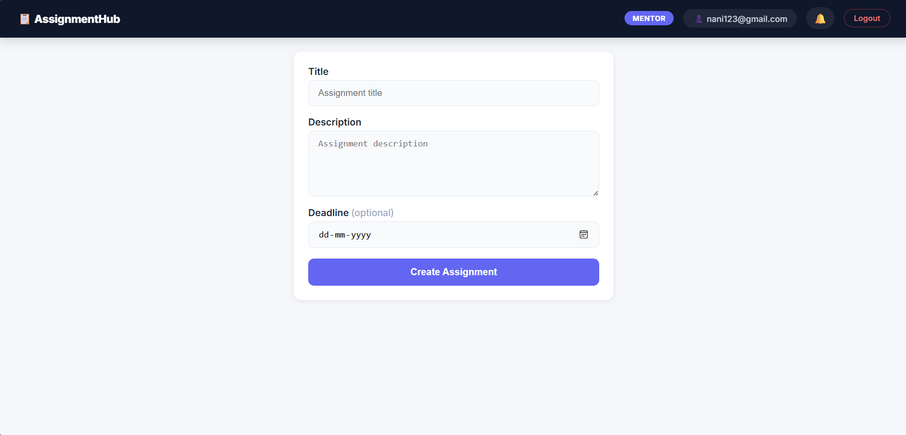

# 📚 Assignment Submission System

Assignment Submission System is a full-stack web application designed to streamline the workflow between mentors and students. Mentors can create assignments, while students can view their assigned work and submit answers through a secure, role-based dashboard.

Built with a clean UI and modular architecture, this project demonstrates practical full-stack development using React, Node.js, Express, and MongoDB.

***

## 🚀 Features

### 👨‍🏫 Mentor Features
- Mentor dashboard with real-time submission tracking
- Assignment creation with deadline management
- Advanced grading system with feedback
- Email notifications on new submissions
- Export grades as CSV

### 🎓 Student Features
- Student dashboard for viewing assigned work
- Assignment submission form
- Drag and drop file upload
- File upload support for documents, images, and videos
- Deadline validation before submission
- Submission status flow
- Grades section on student dashboard
- Feedback display for reviewed submissions
- Submission history tracking

### 🔐 Common Features
- User registration and login system
- JWT authentication with refresh tokens
- Role-based access for mentor and student
- Profile update support
- Password reset via email
- Email integration in the submission flow
- Clean and modular folder structure
- Responsive design

***

## 🛠️ Tech Stack

### Frontend
- React.js with Hooks
- React Router DOM
- CSS3 (Responsive)
- Axios for API calls

### Backend
- Node.js
- Express.js
- MongoDB with Mongoose
- JWT Authentication
- bcryptjs
- Nodemailer
- Multer (File Upload)
- Joi (Input Validation)

### Other Tools
- REST APIs
- Environment Configuration
- CORS enabled

***

## 📂 Project Structure

```bash
assignment_submission_system/
│
├── backend/
│   ├── controllers/     # Business logic
│   ├── middleware/      # Auth & validation middleware
│   ├── models/          # MongoDB schemas
│   ├── routes/          # API routes
│   ├── services/        # Email, file services
│   ├── utils/           # Helper functions
│   ├── server.js        # Entry point
│   └── .env.example
│
├── frontend/
│   └── src/
│       ├── components/  # Reusable components
│       ├── pages/       # App pages
│       ├── services/    # API calls
│       ├── hooks/       # Custom React hooks
│       ├── context/     # Auth Context
│       └── App.js       # Main routing
│
└── package.json
```

***

## ⚙️ Installation & Setup

### 1. Clone the Repository

```bash
git clone [your-repository-url]
cd assignment_submission_system
```

### 2. Setup Backend

```bash
cd backend
npm install
```

Create a `.env` file inside `backend/` and add:

```env
MONGO_URI=your_mongodb_connection_string
JWT_SECRET=your_secret_key_min_32_chars
JWT_EXPIRY=7d
PORT=5000
NODE_ENV=development

# Email Configuration
EMAIL_HOST=smtp.gmail.com
EMAIL_PORT=587
EMAIL_USER=your_email@gmail.com
EMAIL_PASS=your_app_password

# File Upload
MAX_FILE_SIZE=10485760
ALLOWED_FILE_TYPES=pdf,doc,docx,pptx,zip,mp4,png,jpg

# Frontend URL
FRONTEND_URL=http://localhost:3000
```

Run the backend server:

```bash
npm start          # Production
npm run dev        # Development with nodemon
```

### 3. Setup Frontend

```bash
cd frontend
npm install
```

Create `.env` file:

```env
REACT_APP_API_URL=http://localhost:5000/api
```

Start frontend:

```bash
npm start
```

***

## 🔐 Environment Variables

| Variable | Description |
|---|---|
| `MONGO_URI` | MongoDB connection string |
| `JWT_SECRET` | Secret key for JWT (min 32 chars) |
| `JWT_EXPIRY` | Token expiration time (e.g., 7d) |
| `PORT` | Backend server port |
| `EMAIL_USER` | Gmail/SMTP email address |
| `EMAIL_PASS` | Email password/app password |
| `MAX_FILE_SIZE` | Max upload size in bytes |
| `ALLOWED_FILE_TYPES` | Comma-separated file types |

***

## 📡 API Endpoints

### Authentication
```
POST   /api/auth/register        - Register new user
POST   /api/auth/login           - User login
POST   /api/auth/refresh         - Refresh JWT token
POST   /api/auth/forgot-password - Send password reset email
```

### Assignments
```
GET    /api/assignments          - List all assignments
POST   /api/assignments          - Create assignment (Mentor)
GET    /api/assignments/:id      - Get assignment details
PUT    /api/assignments/:id      - Update assignment (Mentor)
DELETE /api/assignments/:id      - Delete assignment (Mentor)
```

### Submissions
```
GET    /api/submissions          - Get user submissions
POST   /api/submissions          - Submit assignment
GET    /api/submissions/:id      - Get submission details
PUT    /api/submissions/:id      - Update submission
```

### Grades
```
POST   /api/grades               - Add grade and feedback
GET    /api/grades/:submissionId - Get grades
PUT    /api/grades/:gradeId      - Update grade
```

***

## 📸 Screenshots

| Sign In | Mentor Dashboard |
|--------|------------------|
|  |  |

| Student Dashboard | Create Assignment |
|------------------|------------------|
|  |  |

***

## 🔐 Security Features

- ✅ JWT Authentication with tokens
- ✅ Password hashing with bcryptjs
- ✅ Server-side input validation
- ✅ CORS protection
- ✅ Role-based access control
- ✅ Protected API routes
- ✅ Email verification support

***

## ✅ Why This Project Matters

- Shows a complete workflow between mentors and students.
- Demonstrates secure authentication and protected routes.
- Proves you can connect frontend and backend APIs in a real product flow.
- Includes real-world features like file upload, deadline checks, grading, and feedback display.
- Makes a strong placement project because it reflects practical full-stack thinking, not just basic CRUD.
- Implements role-based access control and permission management.
- Uses proper error handling and validation.
- Structured with scalable architecture (services, middleware patterns).

***

## 🚧 Future Scope

- 📊 Advanced analytics dashboard for mentors
- 📈 Class performance statistics and charts
- 🔔 Email-based deadline reminder notifications
- 🧾 Detailed grading rubrics
- 📱 Mobile app version (React Native)
- 🔍 Plagiarism detection integration
- 🌐 Multi-language support
- 🖥️ Live deployment with hosted frontend and backend
- 🧪 Additional test coverage

***

## 🧠 Key Learning Outcomes

- ✅ Built a full-stack application using React and Node.js
- ✅ Implemented authentication using JWT and bcrypt
- ✅ Designed role-based access control for mentors and students
- ✅ Built assignment creation and submission workflows
- ✅ Managed file uploads with validation and storage
- ✅ Implemented deadline validation and submission status tracking
- ✅ Created email notification system
- ✅ Structured scalable frontend and backend architecture
- ✅ Implemented proper error handling and input validation
- ✅ Used MongoDB with proper schema design and indexing

***

## 👩‍💻 Author

**Trisha Patil**  
GitHub: [github.com/trisha-patil05](https://github.com/trisha-patil05)  
LinkedIn: [linkedin.com/in/trisha-patil05](https://www.linkedin.com/in/trisha-patil05/)

***

## 🌟 Support

If you found this project helpful, consider giving it a ⭐ on GitHub!
